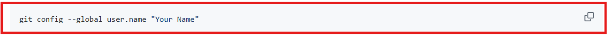
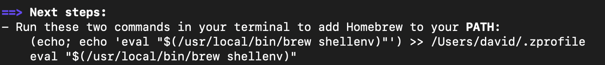

# 

Welcome! In this guide, we'll install the software needed for the course.

### Before You Begin

Before you begin, make sure you have:

- macOS 13 Ventura or newer
- Administrator access to your computer
- At least 20 GB of free storage space

### Copying text in code blocks

To copy text from code blocks, use your mouse to hover over the code block. A **Copy** button will appear. Click this, and the code will be put on your clipboard, ready to be pasted.




# 1. Install Slack

Slack is our primary communication platform.

Download and install Slack:

- https://slack.com/downloads/mac

After installation:

1. Open Slack.
2. Sign in.
3. Enable notifications.


# 2. Install Visual Studio Code

Visual Studio Code (VS Code) is the code editor we will use throughout the course.

Download and install VS Code:

- https://code.visualstudio.com/Download

After installation:

1. Open VS Code.
2. **Continue without Signing In**
3. Press `⌘ + Shift + P`.
4. Search for:

```text
Shell Command: Install 'code' command in PATH
```

4. Select the command.
5. Close and reopen Terminal.


# 3. Install Homebrew then Git

Open Terminal and run:

```bash
/bin/bash -c "$(curl -fsSL https://raw.githubusercontent.com/Homebrew/install/HEAD/install.sh)"
```

If you are prompted to install any Xcode tools, **say yes.**

After completing the installation, you will likely be prompted to enter further commands found in the **Next steps** section in your terminal to finalize the installation. ***You must complete the actions in this prompt before proceeding.***



If you have a similar message, you ***must*** run the commands that are displayed in your terminal (feel free to copy and paste them!). **Do not enter the commands shown above. They will not work. You must copy the commands listed in your own terminal and run them.**

If no commands are shown under the next steps, you may continue.

### Install Git

Git is a version control system used by software developers.

Install Git using Homebrew:

```bash
brew install git
```

Verify installation:

```bash
git --version
```


# 4. Create a GitHub Account

GitHub is where we will store and share our code.

Create an account:

- https://github.com

Please remember:

- Use an email address you can access.
- Save your password somewhere safe.


# 5. Configure Git

Open your **Terminal** (you can use `⌘ Cmd + Space` to open spotlight and search for **Terminal**)

💡 _**Tip:** Right-click the Terminal icon in your dock and select **Keep in dock**. We'll use the Terminal throughout the course._

Replace the example values below with your own information.

```bash
git config --global user.name "Your Name"
```

```bash
git config --global user.email "your@email.com"
```

Set the default branch:

```bash
git config --global init.defaultBranch main
```

Set VS Code as the default editor:

```bash
git config --global core.editor "code --wait"
```


# 6. Install Node.js

Node.js allows us to run JavaScript outside the browser.

Install Node.js:

```bash
brew install node
```


# 7. Install Google Chrome

We recommend using Google Chrome throughout the course.

Download and install Chrome:

- https://www.google.com/chrome/

After installation:

1. Open Google Chrome.
2. Sign in with your Google account (optional).
3. When prompted, **set Chrome as your default browser.**

If you are not prompted automatically:

1. Open **System Settings**.
2. Select **Desktop & Dock**.
3. Scroll to **Default web browser**.
4. Select **Google Chrome**.

Verify Chrome opens when you click a web link in slack.


# 8. Optional: Customize Your Terminal

This setup is completely optional and is only intended to make your terminal easier to read and more similar to the instructor's terminal.

Open Terminal and run:

```bash
nano ~/.zshrc
```

Add the following into the file (add it to the bottom if the file is not empty):

```bash
autoload -U colors && colors
autoload -Uz vcs_info

zstyle ':vcs_info:git:*' formats ' %F{yellow}(%b)%f'

precmd() {
  vcs_info
}

setopt PROMPT_SUBST

PROMPT='%F{green}%n@%m %F{blue}%~${vcs_info_msg_0_}%f
$ '
```

Save the File

1. Press `Ctrl + O`
2. Press `Return`
3. Press `Ctrl + X`

Reload Your Configuration:

```bash
source ~/.zshrc
```

# Verify Everything Works

Run the following commands:

```bash
code --version
```

```bash
brew --version
```

```bash
git --version
```

```bash
git config --list
```

```bash
node -v
```

```bash
npm -v
```


Keep your screen open until an instructor verifies your setup is complete.

---

# 🎉 Congratulations!

You are ready to begin the course.
