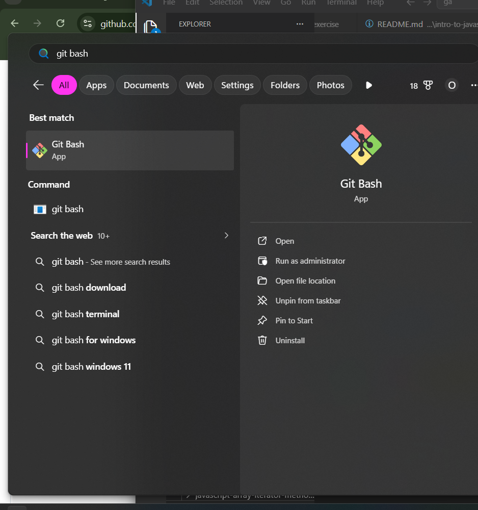
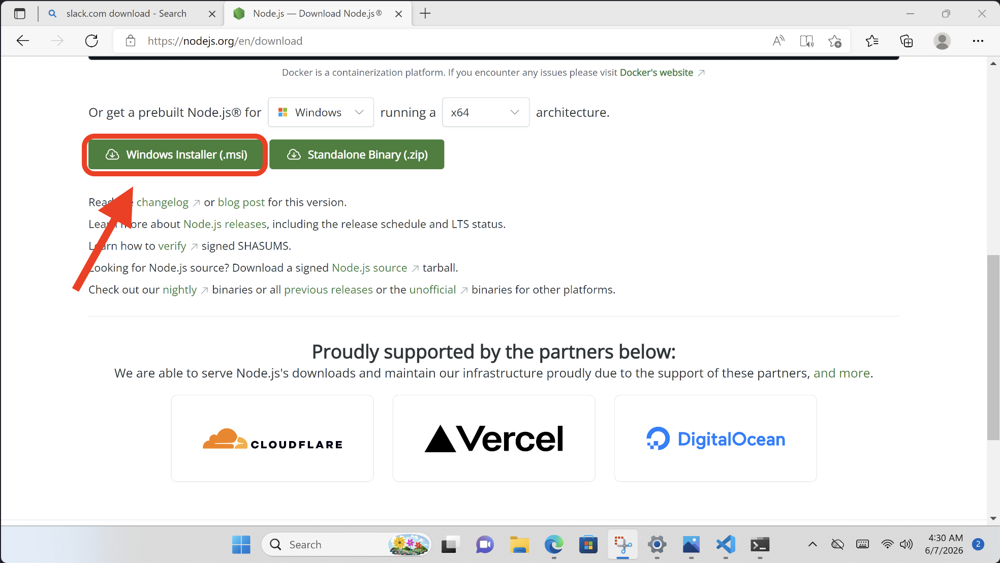
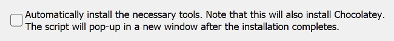

# 

Welcome! In this guide, we'll install the software needed for the course.

### Before You Begin

Make sure you have:

- A laptop running macOS or Windows 11
- Administrator access to your computer
- A stable internet connection
- At least 20 GB of free storage space

### Copying text in code blocks

To copy text from code blocks, use your mouse to hover over the code block. A **Copy** button will appear. Click this, and the code will be put on your clipboard, ready to be pasted.


# 1. Install Slack

Slack is our primary communication platform.

Download and install:

- https://slack.com/intl/en-gb/downloads/windows

After installation:

1. Open Slack.
2. Sign in.
3. Enable notifications.

# 2. Install Visual Studio Code

Visual Studio Code (VS Code) is the code editor we will use throughout the course.

Download and install:

- https://code.visualstudio.com/Download

After installation:

1. Open VS Code.
2. **Continue without Signing In**
3. Close VS Code.


# 3. Create a GitHub Account

GitHub is where we will store and share our code.

Create an account:

- https://github.com

Please remember:

- Use an email address you can access regularly.
- Save your password somewhere safe.


# 4. Install Git

Git is a version control system used by software developers.

Download and install:

- https://git-scm.com/install/windows

***Do not change the install location.***


Click `next` for all options. we will install the default settings and configure some of them in the next step.

- To check if its installed correctly search for the app `git bash` on your computer. If you see the app below you are good to move to step 4



# 5. Configure Git
Open your **git bash** app from the previous step.


Copy and paste the following into the git bash command line. NOTE: command line on windows doesn't use `cntrl + v` for paste. You should right click and paste for now (or `shift` + `insert` on your keyboard)

1. This should be your github username
```bash
git config --global user.name "Your Name"
```

2. This one should be your email that you signed up to github with
```bash
git config --global user.email "your@email.com"
```

Set the default branch:

```bash
git config --global init.defaultBranch main
```

Set VS Code as the default editor:

```bash
git config --global core.editor "code --wait"
```


# 6. Install Node.js

Node.js allows us to run JavaScript outside the browser.

Download and install:

- https://nodejs.org/en/download


Scroll down until you see **Windows Installer (.msi)** then download and install.



### Important

- Accept the default settings.
- **Do not check Automatically install necessary tools**. 

_Leave this box unchecked_




# 7. Install Google Chrome

We recommend using Google Chrome throughout the course.

Download and install Chrome:

- https://www.google.com/chrome/

After installation:

1. Open Google Chrome.
2. Sign in with your Google account (optional).
3. When prompted, **set Chrome as your default browser.**

If you are not prompted automatically:

1. Open **Settings**.
2. Select **Apps**.
3. Select **Default Apps**.
4. Search for **Google Chrome**.
5. Select **Set default**.

Verify Chrome opens when you click a web link from slack.

# 8. Install Clevershare

Clevershare allows you to share your screen for presentations.

Download and install:

- https://www.clevertouch.com/clevershare2g


# Verify Everything Works

Run the following commands:

```bash
code --version
```

```bash
git --version
```

```bash
git config --list
```

```bash
node -v
```

```bash
npm -v
```


Keep your screen open until an instructor verifies your setup is complete.

---

# 🎉 Congratulations!

You are ready to begin the course.